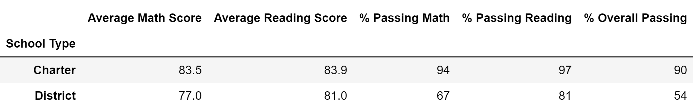

# School District Analysis

## Overview of the school district analysis: 
The school board has discovered that the students_complete.csv file shows evidence of academic dishonesty; specifically, reading and math grades for Thomas High School ninth graders appear to have been altered. The full extent of the academic dishonesty is unknown, and in order to address this concern, I've replaced the ninth grade math and reading scores for Thomas High School with NaNs. I then repeated the school district analysis with the ammended data and compared it to the original school district analysis. 

## Results: 

### How is the district summary affected?
+ As seen in Figure 1 and 2 below, the school district summary was relatively unchanged by the ammendment of 9th grade Thomas High School data. The original average math score decreased from 79.0 to 78.9. The average reading score stayed the same at 81.9. Percent passing math decreased from 75.0% to 74.8%. Percent passing reading decreased from 85.8% to 85.7%. Percent overall passing decreased from 65.2% to 64.9%. 

_Figure 1. Original District Summary_

_Figure 2. Ammended District Summary_

### How is the school summary affected?
+ The Thomas High School school summary was affected by the ammended data because the 9th graders weren't counted in the passing percentages, but were still counted in the total student population. This caused a drastic decrease in percent passing math, percent passing reading, and overall passing percentage and can be seen in comparing Figure 3 and Figure 5.
+ Once the Thomas High School 9th graders were removed from the total population count, the school summary is relatively unchanged compared to the original. This can be seen when comparing Figure 3 and Figure 5.

_Figure 3. Original Thomas High School Summary_

_Figure 4. Ammended Thomas High School Summary with 9th graders included in total population count_

_Figure 5. Ammended Thomas High School Summary with 9th graders excluded in total population count_

### How does replacing the ninth graders’ math and reading scores affect Thomas High School’s performance relative to the other schools?
+ Thomas High School remains the second best rated school even with the replacement of 9th grade math and reading scores. See Figure 6 and 7 to compare.

_Figure 6. Original Top 5 Schools_

_Figure 7. Ammended Thomas High School Summary with 9th graders excluded in total population count_

### How does replacing the ninth-grade scores affect the following:
#### Math and reading scores by grade
+ The only math and reading scores by grade that were affected were the Thomas High School 9th graders because they were replaced by NaNs. See Figures 8-11 to compare the original average math and reading scores by grade with the ammended average scores by grade.

_Figure 8. Original Average Math Scores by Grade_

_Figure 9. Original Average Reading Scores by Grade_

_Figure 10. Ammended Average Math Scores by Grade_

_Figure 11. Ammended Average Reading Scores by Grade_

#### Scores by school spending
+ The scores by school spending were unaffected by the ammendment of Thomas High School's 9th grade data. The more money spent per student does not correlate with increased average math or reading scores or increased math, reading, or overall passing percentages. The schools that spent the least per student remained having the highest overall math and reading passing percentage.

_Figure 12. Original Scores by School Spending Per Student_

_Figure 13. Ammended Scores by School Spending Per Student_

#### Scores by school size
+ The scores by school size were unaffected by the ammendment of Thomas High School's 9th grade data. Large schools remained having the lowest average math and reading scores as well as the lowest math, reading, and overall passing percentages. 

_Figure 15. Original Scores by School Size_

_Figure 15. Ammended Scores by School Size_

#### Scores by school type
+ The scores by school type were unaffected by the ammendment of Thomas High School's 9th grade data. Charter schools remained having the highest average math and reading scores as well as the highest math, reading, and overall passing percentages. 

_Figure 15. Original Scores by School Type_

_Figure 15. Ammended Scores by School Type_

## Summary: Summarize four changes in the updated school district analysis after reading and math scores for the ninth grade at Thomas High School have been replaced with NaNs.
As discussed above, the school district summary was relatively unchanged by the ammendment of 9th grade Thomas High School data. The original average math score decreased by 0.1. The average reading score stayed the same at 81.9. Percent passing math decreased by 0.2%. Percent passing reading decreased by 0.1%. Lastly, percent overall passing decreased by 0.3%. 